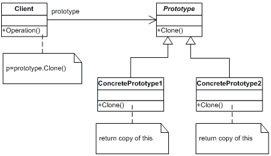

# Паттерн Прототип (Prototype)

---

### Призначення

Задає види об'єктів, що створюються за допомогою екземпляру-прототипу, та створює нові об'єкти шляхом копіювання цього прототипу.

---

### Застосування
- Уникнути додаткових зусиль для створення об'єкта; <!-- .element: class="fragment" data-fragment-index="1" -->
- Уникнути побудови ієрархії класів або фабрик; <!-- .element: class="fragment" data-fragment-index="2" -->
- Екземпляри класу можуть знаходитися в одному з небагатьох різних станів. <!-- .element: class="fragment" data-fragment-index="3" -->

---

### Структура



---

### Учасники

- **Prototype**: оголошує інтерфейс для клонування себе;
- **ConcretePrototype**: реалізує операцію клонування себе;
- **Client**: створює новий об'єкт, звертаючись до прототипу з запитом клонувати себе.

---

### Приклад

---

```python
import copy

class Prototype:
    _type = None
    _value = None

    def clone(self):
        pass

    def getType(self):
        return self._type

    def getValue(self):
        return self._value
```

---

```python
class Type1(Prototype):
    def __init__(self, number):
        self._type = "Type1"
        self._value = number

    def clone(self):
        return copy.copy(self)

class Type2(Prototype):
    def __init__(self, number):
        self._type = "Type2"
        self._value = number

    def clone(self):
        return copy.copy(self)
```

---

```python
class Client:
    __instance1 = None
    __instance1 = None

    @staticmethod
    def initialize():
        Client.__instance1 = Type1(1)
        Client.__instance2 = Type1(2)

    @staticmethod
    def getInstance1():
        return Client.__instance1.clone()

    @staticmethod
    def getInstance2():
        return Client.__instance2.clone()
```

---

```python
def main():
    Client.initialize()

    client = Client.getInstance1()
    print '{} {}'.format(client.getType(), client.getValue())

    client = Client.getInstance2()
    print '{} {}'.format(client.getType(), client.getValue())


if __name__ == "__main__":
    main()

```

---

```bash
$ python example.py
$ Type1 1
$ Type1 2
```

---

# Дякую за увагу!
